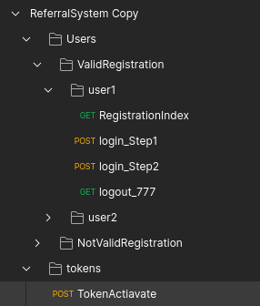
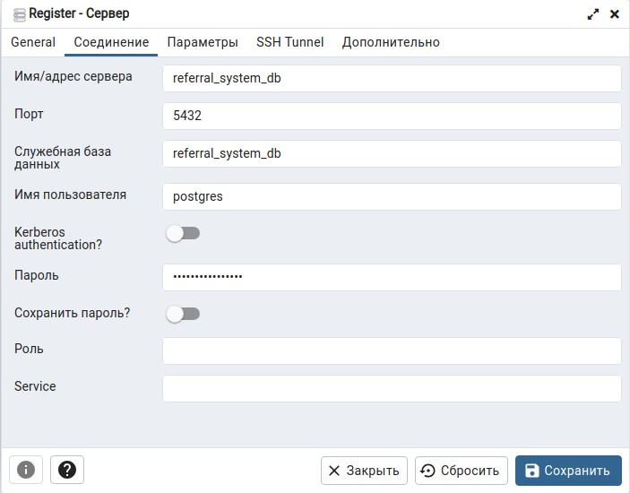

<h1 align="center">Тестовое задание Python разработчик (Django) 
<a href='https://hammer.systems/'>
(Hammer Systems)
</a>
</h1>


<h2 align="center">1. Структура репозитория:

</h2>

    .
    ├── app   -> Приложение
    ├── README.md -> Описание (мы тут)
    ├── ReferralSystem.postman_collection.json - коллекция Postman
    └── TASK.docx -> ТЗ

<h2 align="center">2. Запуск

</h2>

1. Клонируем репозиторий

```
    git clone git@github.com:Alset-Nikolas/ReferralSystem.git
```
2. Настройка файла infra/.env
```
    SECRET_KEY = 'django-insecure-r7lng6xaaystn%o45+l=_63gqr*h^cc$i68&-x!a0n#%&^eh5v'
    
    DB_ENGINE=django.db.backends.postgresql
    DB_NAME=referral_system_db 
    POSTGRES_USER=postgres
    POSTGRES_PASSWORD=qwerty1234QWERTY
    DB_HOST=refferal_system_db
    DB_PORT=5432 

    DJANGO_SUPERUSER_PHONE=7-000-000-0000
```


3. Собрать и запустить контейнеры
  ```
  sudo docker-compose build
  sudo docker-compose up
  ```

    
<h2 align="center">3. Иллюстрация</h2>


Регистрация пользователя происходит при первой авторизации.<br>
Пользователь вбивает свой номер, например 7-999-100-1031<br>
Дальше нужно ввести 4х значный код: для простоты это 4 последние цифры номера (для нашего примера это 1031)   <br>


<details>
  <summary>Авторизация по номеру телефона. Первый запрос на ввод номера телефона.</summary>
  
</details>
<details>
  <summary>Пример ввода другого формата на 1 запрос</summary>
  
</details>
<details>
  <summary>Имитировать отправку 4х значного кода авторизации</summary>
  
</details>
<details>
  <summary>Пример ввода ошибочного токена на 2 запрос</summary>
  
</details>

<br>


После авторизации пользователь попадает в свой профиль.
При первой авторизации рандомно генерируется 6-значный инвайт-код (у меня L5C4Yp)
<details>
  <summary>Профиль пользователя 7-999-100-1031 (L5C4Yp)</summary>
  
</details>
<details>
  <summary>Профиль пользователя 7-777-777-7777 (R42HbT)</summary>
  
</details>
<br>

В профиле у пользователя есть возможность ввести чужой инвайт-код<br>
В своем профиле можно активировать только 1 инвайт код<br>
<details>
  <summary>Активация токена L5C4Yp у пользователя 7-777-777-7777</summary>
  
</details>
<details>
  <summary>Попытка активации своего или несуществующего токена</summary>
  
</details>
<br>

В профиле должен выводиться список пользователей, которые ввели инвайт код текущего пользователя.
<details>
  <summary>Список пользователей</summary>
  
</details>


<h2 align="center">4. Документация Api

</h2>
Если перейти по /swagger-ui/ будет Swagger-ui


<h2 align="center">5. Админка

</h2>
Если перейти по /admin/ будет форма авторизации. Если зайти под админом откроется адмнка


<h2 align="center">6. Postman

</h2>

<div align="center">

</div>


<h2 align="center">7. Для тестов полезен pgAdmin

</h2>
http://ip_server:5555/
<div align="center">

</div>

Инструкция по запуску
<details>
  <summary>логин/пароль --> z@mail.ru/z</summary>
  <div align="center">
    
  </div>
</details>
<details>
  <summary>Servers/Register/Сервер...</summary>
  <div align="center">
    
  </div>
</details>
<details>
  <summary>Имя - любое</summary>
  <div align="center">
    
  </div>
</details>
<details>
  <summary>refferal_system_db/5432/referral_system_db/postgres/qwerty1234QWERTY</summary>
  <div align="center">
    
  </div>
</details>
<details>
  <summary>Ура</summary>
  <div align="center">
    
  </div>
</details>
